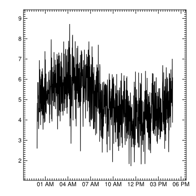
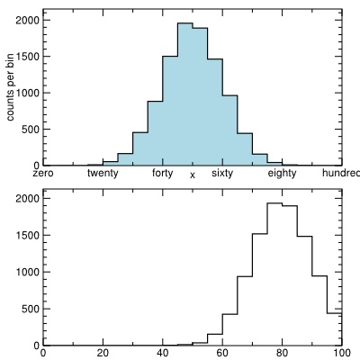
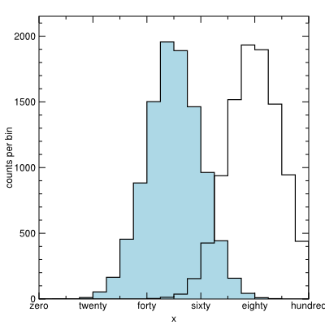
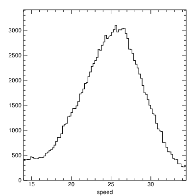

Tutorial with examples
======================

Introduction
------------

Cassius is a plotting toolkit, intended for interactive use.  As such,
the commands that users type have been simplified as much as
possible.  To start Cassius (see `Installation <installation>`_ if
necessary), start an interactive Python session and load the
user-level objects::

   linux> python
   Python 2.6.6 (r266:84292, Sep 15 2010, 16:22:56) 
   [GCC 4.4.5] on linux2
   Type "help", "copyright", "credits" or "license" for more information.
   >>> from cassius import *
   >>> import random, math

The `from module import *` idiom is normally discouraged in Python as
it loads objects into global scope, rather than keeping them in
separate namespaces.  However, it is inconvenient to type "`cassius.`"
in front of everything (or even "`c.`") when you're working interactively.  A complete list of objects
loaded by this statement is presented `here <organization>`_.  

Histogram
^^^^^^^^^

The two basic plot containers in Cassius are `Histogram` and
`Scatter`.  Histograms represent distributions, including bar charts
and (someday) pie charts, in a single interface.  Scatters represent
general X-Y data, including time-series, parametric lines, and data
with error bars.  Here are some examples::

   >>> h = Histogram(20, 0., 100.)
   >>> h
   <Histogram 20 0 100 at 0x1d0edd0>
   >>> print h
   bin                            value
   ========================================
   [0, 5)                         0
   [5, 10)                        0
   [10, 15)                       0
   [15, 20)                       0
   [20, 25)                       0
   [25, 30)                       0
   [30, 35)                       0
   [35, 40)                       0
   [40, 45)                       0
   [45, 50)                       0
   [50, 55)                       0
   [55, 60)                       0
   [60, 65)                       0
   [65, 70)                       0
   [70, 75)                       0
   [75, 80)                       0
   [80, 85)                       0
   [85, 90)                       0
   [90, 95)                       0
   [95, 100)                      0

   >>> for i in xrange(10000):
   ...     h.fill(random.gauss(50., 10.))
   ... 
   >>> print h
   bin                            value
   ========================================
   [0, 5)                         0
   [5, 10)                        0
   [10, 15)                       2
   [15, 20)                       6
   [20, 25)                       41
   [25, 30)                       169
   [30, 35)                       421
   [35, 40)                       876
   [40, 45)                       1515
   [45, 50)                       1937
   [50, 55)                       1920
   [55, 60)                       1501
   [60, 65)                       932
   [65, 70)                       447
   [70, 75)                       168
   [75, 80)                       52
   [80, 85)                       12
   [85, 90)                       1
   [90, 95)                       0
   [95, 100)                      0
   >>> view(h)

If you have the optional viewer installed, a window will pop up
containing a plot that looks like the one below.  If not, you will get
an error message telling you to `draw` the plot to a file and look at
it with an external viewer::

   >>> draw(h, fileName="/tmp/tmp.svg")
   linux> inkview tmp.svg

.. image::
   PLOTS/Tutorial_10.png

In this tutorial, I will use `view`, but you can always substitute
`draw`.  Note that you can also `drawpdf`, which works the same way
(see the `svgdraw module <reference_svgdraw>`_).

Now, one must always label one's axes...

::

   >>> h.xlabel = "x"
   >>> h.ylabel = "counts per bin"
   >>> view(h)

.. image::
   PLOTS/Tutorial_20.png

In the above, we attached an `xlabel` and a `ylabel` to the histogram.
Nearly all options can be passed as constructor arguments

::

   >>> h2 = Histogram(20, 0., 100., xlabel="x", ylabel="counts per bin")

or set as data members (`h2.xlabel`, `h2.ylabel`).

Arguments specifying the coordinate frame (frame arguments) can also
be specified directly in the `view` or `draw` command, overriding the
object but not "sticking" to the object (see `Percolation
<percolation>`_ for details).  This allows for quicker
experimentation.

::

   >>> view(h, xlabel="I like this title better")

.. image::
   PLOTS/Tutorial_30.png

Histograms can, of course, be colored::

   >>> h.fillcolor = "lightblue"
   >>> view(h)

.. image::
   PLOTS/Tutorial_40.png

See `Histogram
<reference_histograms#histogram-1-d-distribution-with-uniform-binning>`_
and `Manipulating color <reference_color>`_ for details.

We can make some dramatic changes to the tick-marks when we need to::

   >>> h.xticks = {0.: "zero",       10.: None,
   ...             20.: "twenty",    30.: None,
   ...             40.: "forty",     50.: None,
   ...             60.: "sixty",     70.: None,
   ...             80.: "eighty",    90.: None,
   ...             100.: "hundred"}
   ... 
   >>> view(h)

.. image::
   PLOTS/Tutorial_50.png

and logarithmic axes have been provided for, but not yet debugged::

   >>> view(h, ylog=True)
   ERROR

.. todo::
   Get logarithmic axes working!

Rebinning histograms after they have been filled is usually limited to
reducing the number of bins by a multiple of an integer.  That's not
convenient.  If you would like to arbitrarily rebin histograms or
change their endpoints, you can give the histogram a "store," which is
a copy of the input data associated to the histogram.  (The
`storelimit`, the maximum number of saved entries, can be set to
`None` for no limit.)

::

   >>> h2 = Histogram(20, 0., 100., storelimit=None)
   >>> for i in xrange(10000):
   ...     h2.fill(random.gauss(80., 10.))
   ... 
   >>> view(h2)

.. image::
   PLOTS/Tutorial_52.png

Now we can rebin or change the endpoints however we like.

::

   >>> h2.reshape(300, 0., 200.)
   >>> view(h2)

.. image::
   PLOTS/Tutorial_54.png

The store allows us to make a distinction between estimators derived
from the histogram's bins and estimators derived from the raw data::

   >>> h2.reshape(20, 0., 100.)
   >>> h2.mean(), mean(h2.store())
   (79.53923778301403, 80.1229660042749)

Sometimes we want to study distributions in a categorical space.  For
that, there is `HistogramCategorical`, which shares some code with
`Histogram` (they both derive from `HistogramAbstract`).

::

   >>> hcat = HistogramCategorical(bins=["one", "two", "three", "four", "five",
   ...                                   "six", "seven", "eight", "nine", "ten"],
   ...                             fillcolor="yellow")
   ... 

   >>> for i in xrange(10000):
   ...     x = {1: "one", 2: "two", 3: "three", 4: "four", 5: "five", 6: "six",
   ...          7: "seven", 8: "eight", 9: "nine", 10: "ten"}[random.randint(1, 10)]
   ...     hcat.fill(x)
   ... 

   >>> print hcat
   bin                            value
   ========================================
   "one"                          1013
   "two"                          1015
   "three"                        1037
   "four"                         965
   "five"                         1022
   "six"                          972
   "seven"                        1016
   "eight"                        943
   "nine"                         1004
   "ten"                          1013
   >>> view(hcat)

.. image::
   PLOTS/Tutorial_60.png

Some would call the above a bar chart.

In categorical datasets dominated by a few values (not this case), it
is often useful to only plot the top N categories::

   >>> view(hcat.top(5))

.. image::
   PLOTS/Tutorial_70.png

A pie chart has the same numerical content, but is drawn as wedges of
a circle.  Therefore, pie charts should be an alternate drawing mode
for `HistogramCategorical` (not yet implemented).

Scatter
^^^^^^^

Scatter-plots are produced with the `Scatter` class::

   >>> xlist = [random.uniform(0., 100.) for i in xrange(100000)]
   >>> ylist = [random.uniform(0., 100.) for i in xrange(100000)]
   >>> scat = Scatter(x=xlist, y=ylist, limit=100)
   >>> view(scat)

.. image::
   PLOTS/Tutorial_80.png

The `limit` parameter protected our SVG renderer from having to draw
100000 data points (which would be solid black).  When a `limit` is
specified (by default it's `None`), only a representative subsample is
drawn.  (The subsample is uniformly selected, it's not the beginning
or the end of the list!)  The `limit` applies to how many points are
shown in the graphic, so if you zoom in, you'll always see the same
level of detail.

There are two ways to load data into a scatter-plot: via two separate
lists (as above) or by interpreting one matrix::

   >>> bothlist = [[random.uniform(0., 50.), random.uniform(0., 100.)] for i in xrange(100)]
   >>> scat = Scatter(bothlist, sig=["x", "y"])
   >>> view(scat, xmin=0., xmax=150., ymin=0., ymax=150.)

.. image::
   PLOTS/Tutorial_100.png

::

   >>> scat = Scatter(bothlist, sig=["y", "x"])
   >>> view(scat, xmin=0., xmax=150., ymin=0., ymax=150.)

.. image::
   PLOTS/Tutorial_90.png

Rather than having a separate container for polygon data, we can make
polygons from a `Scatter` just by turning off the markers and turning
on a line connecting the points::

   >>> scat.connector = "unsorted"
   >>> view(scat)

.. image::
   PLOTS/Tutorial_110.png

::

   >>> scat.marker = None
   >>> view(scat)

.. image::
   PLOTS/Tutorial_120.png

It's like a time-series when the lines connect points from left to right::

   >>> scat.connector = "xsort"
   >>> view(scat)

.. image::
   PLOTS/Tutorial_130.png

It's even more like a timeseries when the x axis is interpreted from
and/or to time strings::

   >>> minutes = totimestring([1e9 + 60*i for i in xrange(1000)], "%d/%m/%Y at %H:%M")
   >>> minutes[:4]
   ['09/09/2001 at 01:46', '09/09/2001 at 01:47', '09/09/2001 at 01:48', '09/09/2001 at 01:49']

   >>> data = [math.sin(2.*math.pi*i/1000) + random.gauss(5., 1.) for i in xrange(1000)]

   >>> ts = TimeSeries(x=minutes, y=data, informat="%d/%m/%Y at %H:%M", outformat="%I %p")
   >>> view(ts)

The `TimeSeries` class derives from `Scatter`, and is only a thin
wrapper around it.

Plots with error bars work the same way: they're `Scatter` objects
with a bit more data::

   >>> dataplot = Scatter(x=[1., 2., 3., 4., 5.],
   ...                    y=[3., 4., 1., 5., 2.],
   ...                    ey=[0.1, 0.15, 0.2, 0.1, 0.5])
   ... 
   >>> view(dataplot)

.. image::
   PLOTS/Tutorial_140.png

There are also x error bars and asymmetric error bars.

Layouts and Overlays
^^^^^^^^^^^^^^^^^^^^

Now that we have made different kinds of plots, we want to put them
side-by-side or on top of each other to see relationships between them
by eye.  Side-by-side plots are produced with a `Layout`::

   >>> view(Layout(2, 1, h, h2))

The structure of this command makes it easy to rearrange the plots
quickly, and `Layout` objects can be nested to produce more complex
arrangements (see `Layout <reference_organization#layout-a-grid-of-plots>`_).

On-top-of-each-other plots are produced with an `Overlay`::

   >>> view(Overlay(h, h2))

.. image::
   PLOTS/Tutorial_160.png

Swapping the top and bottom plot requires very few keystrokes::

   >>> view(Overlay(h2, h))

.. image::
   PLOTS/Tutorial_170.png

We can also ask the `Overlay` to use the histograms' own coordinate
frame, not one built around the union of all the data (see `Overlay
<reference_organization#overlay-multiple-plots-in-the-same-coordinate-frame>`_
for more)::

   >>> view(Overlay(h, h2, frame=0))

For the special case of histograms, we can also `Stack`::

   >>> h2.fillcolor = "pink"
   >>> view(Layout(2, 1, Stack(h, h2), Stack(h2, h)))

.. image::
   PLOTS/Tutorial_185.png

Again, the order determines which is on top.

Gridlines, legends, and such
^^^^^^^^^^^^^^^^^^^^^^^^^^^^

Plot annotations are objects in the same sense as `Histograms` and
`Scatters`, so they are simply overlaid::

   >>> scat.connector = None
   >>> scat.marker = "circle"

   >>> grid = Grid(regular(5.), regular(5.))
   >>> view(Overlay(grid, scat))

.. image::
   PLOTS/Tutorial_190.png

which gives you the choice of lines-on-bottom (graph paper) or lines-on-top (jail).

Legends work the same way::

   >>> legend = Legend([[scat, "data!"]], justify="c")
   >>> view(Overlay(grid, scat, legend))

.. image::
   PLOTS/Tutorial_200.png

(The legend is free-form: you can put whatever you want in it.  See
`Legend <reference_legend>`_ for more.)

There are some limited 2-D plots, but they're in development.

The `Curve` class provides mathematical curves (see `Mathematical
curve <reference_curves>`_).  This is the part of Cassius that
provides curve-fitting as well, though that is in developement
(actually, just porting from Minuit to SciPy).

Realistic case: analyzing a large dataset
-----------------------------------------

Now that we can plot random numbers, let's look at some real data.  If
you haven't already, download `Augustus 0.4.3.1.tar.gz
<http://code.google.com/p/augustus/downloads/detail?name=Augustus-0.4.3.1.tar.gz>`_
and unpack it::

      linux> tar -xzvf Augustus-0.4.3.1.tar.gz

The file

::

   Augustus-0.4.3.1/examples/highway/real/data/scoring.csv

contains 25 MB of motor vehicle speeds measured by traffic monitoring
devices in the Chicago area.

We load it into Python with `inspect`::

   >>> from cassius import *
   >>> import math, itertools
   >>> highway = inspect("Augustus-0.4.3.1/examples/highway/real/data/scoring.csv")

and take a look at the number of records (rows)

::

   >>> len(highway)
   188529

the names of the features (column headers)

::

   >>> highway.keys()
['fielddeviceid', 'locationtimestamp', 'devicestatus', 'datastatus', 'locstatus', 'lastupdatetime', 'volume', 'speed', 'occupancy']

and the first few entries::

   >>> highway.scan()
   fielddevicei locationtime devicestatus   datastatus    locstatus lastupdateti       volume        speed    occupancy
   ====================================================================================================================
   'IL-TESTTSC-   1174330073 'NON_OPERATI 'FIELD_DATA_ 'LOCATION_RE 1175058600000            0            0            0
   'IL-TESTTSC-   1174330073 'NON_OPERATI 'FIELD_DATA_ 'LOCATION_RE 1175058600000            0            0            0
   'IL-TESTTSC-   1174330073 'NON_OPERATI 'FIELD_DATA_ 'LOCATION_RE 1175058600000            0            0            0
   'IL-TESTTSC-   1174330073 'NON_OPERATI 'FIELD_DATA_ 'LOCATION_RE 1175058600000            0            0            0
   'IL-TESTTSC-   1174330073 'NON_OPERATI 'FIELD_DATA_ 'LOCATION_RE 1175058600000            0            0            0
   'IL-TESTTSC-   1174330073 'OPERATIONAL 'FIELD_DATA_ 'LOCATION_RE 1175058600000           78      22.2683      2.75029
   'IL-TESTTSC-   1174330073 'OPERATIONAL 'FIELD_DATA_ 'LOCATION_RE 1175058600000          219       24.431      7.25412
   'IL-TESTTSC-   1174330073 'OPERATIONAL 'FIELD_DATA_ 'LOCATION_RE 1175058600000           87      17.0116       3.7582
   'IL-TESTTSC-   1174330073 'OPERATIONAL 'FIELD_DATA_ 'LOCATION_RE 1175058600000           61      18.4633      2.71703
   'IL-TESTTSC-   1174330073 'OPERATIONAL 'FIELD_DATA_ 'LOCATION_RE 1175058600000           99      16.9542      4.30594

The "speed" field is probably pretty interesting; let's take a look::

   >>> #                      what to plot   cuts to apply
   >>> view(highway.histogram("speed",       "speed > 0."))

(The `speed > 0.` requirement eliminates `NaNs`.)

Presumably, people drive on different streets at different speeds.
The "fielddeviceid" column indicates the location where the speed was
measured.  How many of them are there?

   >>> len(highway.unique("fielddeviceid"))
   807

Too many to work with my hand--- our analysis will need to be automated.

::

   >>> # simplify the table to just arrays, selected with speed > 0.
   >>> fielddeviceid, speed = highway("fielddeviceid, speed", "speed > 0.")

   >>> # make a histogram for each "fielddeviceid" (segmentation)
   >>> histograms = {}
   >>> for f, s in itertools.izip(fielddeviceid, speed):
   ...     if f not in histograms:
   ...         histograms[f] = Histogram(70, 0., 70.)
   ...         histograms[f].name = f     # name is something I just made up
   ...     histograms[f].fill(s)
   ... 

   >>> # sort a list of these histograms by average speed
   >>> histlist = histograms.values()
   >>> histlist.sort(lambda a, b: cmp(a.mean(), b.mean()))

   >>> # plot the average speeds of each histogram (with error bars)
   >>> byspeed = Scatter(x=range(len(histlist)),
   ...                   y=[h.mean() for h in histlist],
   ...                   ey=[h.stdev()/math.sqrt(h.entries) for h in histlist])
   ... 
   >>> lines = Grid(horiz=[20., 30.])
   >>> view(Overlay(lines, byspeed), xlabel="sorted index", ylabel="average speed")

.. image::
   PLOTS/Tutorial2_20.png

There are three rough categories: slow roads (average is less than 20
MPH), fast roads (average is greater than 30 MPH), and the rest of
them, which constitutes about 80%.

::

   >>> # just look at the fast ones
   >>> fast_ones = [h for h in histlist if h.mean() > 30.]

   >>> # make a stack of histograms and give each one a different color
   >>> colors = lightseries(len(fast_ones))
   >>> for h, c in zip(fast_ones, colors):
   ...     h.fillcolor = c
   ... 
   >>> stack = Stack(*fast_ones, xlabel="speed")

   >>> # make a legend linking colors to street names
   >>> legend1 = Legend(names[:len(names)/2], justify="cl", textscale=0.5, x=0., anchor="tl", colwid=[0.2, 0.8])
   >>> legend2 = Legend(names[len(names)/2:], justify="cl", textscale=0.5, x=1., anchor="tr", colwid=[0.2, 0.8])

   >>> view(Overlay(legend1, legend2, stack, frame=-1))

.. image::
   PLOTS/Tutorial2_30.png

That one at 60 MPH certainly stands out: it's the Edens, which runs
along Lake Michigan.  I'll just pick out a slow, a fast, and two
weirdos.

::

   >>> one = [h for h in fast_ones if h.name == "IL-TESTTSC-KENNEDY-W-2128"][0]
   >>> two = [h for h in fast_ones if h.name == "IL-TESTTSC-ROUTE_53-N-11109"][0]
   >>> three = [h for h in fast_ones if h.name == "IL-TESTTSC-I_57-N-9017"][0]
   >>> four = [h for h in fast_ones if h.name == "IL-TESTTSC-EDENS-S-1037"][0]

   >>> # format them nicely for viewing
   >>> for h in one, two, three, four:
   ...     h.xlabel = h.name
   ...     h.bottommargin = 0.2
   ...     h.xlabeloffset = 0.2
   ... 
   >>> view(Layout(2, 2, one, two, three, four))

.. image::
   PLOTS/Tutorial2_40.png

That bimodal distribution in the Kennedy, I wonder if it might be related to time.

::

   >>> speedvstime = highway.timeseries("lastupdatetime, speed",
   ...                                  "fielddeviceid == 'IL-TESTTSC-KENNEDY-W-2128'",
   ...                                  outformat="%b %y")
   >>> view(speedvstime)

.. image::
   PLOTS/Tutorial2_50.png

Yup.  It is.  That's probably a data-quality issue--- cars don't
oscillate sharply between 15 MPH and 40 MPH on a yearly basis.

We could go on and on; there are a lot of interesting features in this
dataset.  However, we have seen how Cassius provides a flexible,
interactive way to do data analysis.  Much more detail on each class
and function is provided in the rest of this document.
